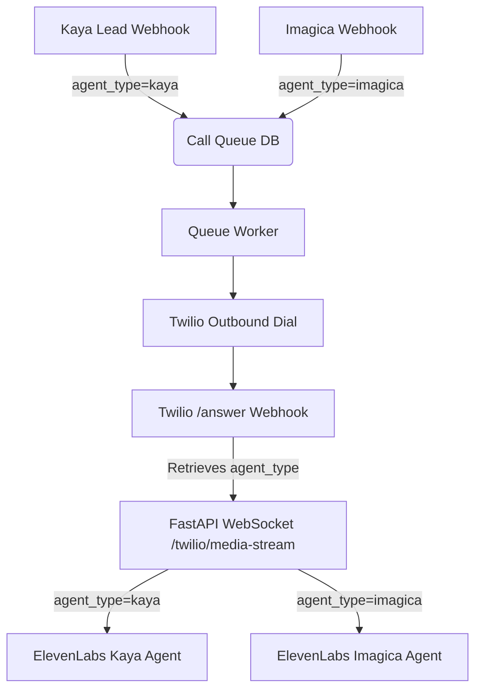

# Implementation Plan: Kaya Clinic Voice Agent Integration

We will add a new Kaya Clinic voice agent campaign to the repository while keeping the existing Imagicaa campaign fully functional. We will achieve this by introducing a multi-tenant/multi-campaign architecture driven by an `agent_type` parameter ("imagica" or "kaya").

## User Review Required

> [!IMPORTANT]
> - **ElevenLabs Agent ID Configuration:** We will define a new `.env` variable `ELEVENLABS_KAYA_AGENT_ID` for the Kaya Clinic agent. In development, if this is missing, it will fall back to `ELEVENLABS_AGENT_ID` (with a warning).
> - **Exclusions respected:** Per your request, we will **NOT** change the fee disclosure timing, add a "blind" slot availability tool, or add email spelling bypass rules. We will implement **only** the Pincode/Branch Lookup tool and the Flow Flexibility rules.

## Proposed Changes

We will introduce a clean multi-agent routing mechanism so both campaigns can run in parallel:

---

### [Component 1] Branch & Pincode Lookup (`kaya_branches.py`)

#### [NEW] [kaya_branches.py](file:///Users/bhaveshtank/imagica-voice-agent/kaya_branches.py)
Create a helper mapping system to resolve branches based on pincode prefixes or city names.
- Map the standard Indian pincode prefixes to cities:
  - `11` -> Delhi
  - `40` -> Mumbai
  - `56` -> Bengaluru
  - `50` -> Hyderabad
  - `60` -> Chennai
  - `41` -> Pune
  - `70` -> Kolkata
  - `38` -> Ahmedabad
  - `39` -> Surat (or Vadodara)
  - `64` -> Coimbatore
- Define a lookup function `get_closest_branches(pincode: str = None, city: str = None) -> list[str]` to return branches. It will map areas/prefixes cleanly to branch names.
- Define a dictionary mapping cities to their branches as detailed in the Kaya Clinic Knowledge Base.

---

### [Component 2] Kaya Clinic System Prompt Builder (`kaya_prompt.py`)

#### [NEW] [kaya_prompt.py](file:///Users/bhaveshtank/imagica-voice-agent/kaya_prompt.py)
Write a prompt builder that generates the Kaya Clinic system prompt.
- Incorporate **Flow Flexibility**: Add a dedicated section instructing Priya to answer out-of-order queries (e.g. services, fees, or location details) in one sentence and then return immediately to the current booking step.
- Include **Pincode Lookup Guidelines**: Instruct the agent to call the `get_closest_branches` tool when the customer provides a pincode or city name, instead of guessing.

---

### [Component 3] Database Schema & Migration (`post_call.py`)

#### [MODIFY] [post_call.py](file:///Users/bhaveshtank/imagica-voice-agent/post_call.py)
Modify the database setup and logging:
- In `init_db` and `_migrate_db`, add `agent_type` (TEXT default `'imagica'`) to `call_queue` and `call_logs`.
- In `log_call` and `enqueue_call`, accept `agent_type` and store it in the database.
- In `get_metrics`, update query statistics to group by `agent_type` if needed, ensuring backward compatibility.

---

### [Component 4] Webhook & Outbound Queue (`main.py`)

#### [MODIFY] [main.py](file:///Users/bhaveshtank/imagica-voice-agent/main.py)
Adapt the FastAPI endpoints to route calls based on campaign:
- Add a new payload model `KayaLeadPayload`:
  - `customer_name: str`
  - `customer_phone: str`
  - `call_type: str = "OUTBOUND"`
  - `cart_id: str` (acts as lead/booking ID)
- Create a new POST endpoint `/webhook/kaya-lead` that enqueues calls with `agent_type = "kaya"`.
- Update `_dispatch_and_dial` to store the correct `agent_type` in the Twilio answer URL query parameter: `/twilio/answer?cart_id={cart_id}&agent_type={agent_type}`.
- Update `/twilio/answer` and the WebSocket endpoint `/twilio/media-stream` to parse `agent_type` from the query string and store it in `call_sessions` or `cart_sessions`.

---

### [Component 5] Twilio/ElevenLabs Audio & Tool Bridge (`voice_agent.py`)

#### [MODIFY] [voice_agent.py](file:///Users/bhaveshtank/imagica-voice-agent/voice_agent.py)
Update the WebSocket audio bridge to support both agents:
- Retrieve `agent_type` in `media_stream_handler`.
- Dynamically build the `session_init` config:
  - If `agent_type == "kaya"`, use `ELEVENLABS_KAYA_AGENT_ID` (loaded from environment), build the prompt using `kaya_prompt.py`, and use the Kaya opening line: *"Thank you for calling Kaya Clinic. This is Priya. How may I help you today?"* (Inbound) or Outbound equivalent.
  - If `agent_type == "imagica"`, use `ELEVENLABS_AGENT_ID` and the existing Imagica prompt.
- Update `execute_tool` to handle Kaya-specific tools:
  - `get_closest_branches`: Returns nearest branches based on city or pincode.
  - `book_appointment`: Finalizes the booking after all customer details have been collected and confirmed. The tool accepts the following parameters:
    - `first_name` (string, required): Customer's first name
    - `last_name` (string, required): Customer's last name
    - `email` (string, required): Customer's confirmed email address
    - `dob` (string, optional): Customer's date of birth
    - `pincode` (string, required): Customer's 6-digit pin code
    - `city` (string, optional): The city for the booking
    - `branch_name` (string, required): The specific Kaya clinic branch chosen
    - `appointment_date` (string, required): The preferred date of the appointment
    - `appointment_time` (string, required): The preferred time slot (e.g., 5:00 PM)
    - `concern_summary` (string, optional): A brief summary of the skin or hair concern
    It will save these details to the SQLite database (under a new `kaya_bookings` table or call logs), set the disposition to `CONVERTED`, and trigger a clean exit of the call.
  - Re-use `schedule_callback` and `transfer_to_human`.

---

## Verification Plan

### Automated Verification
We can run our local tests using mock API calls:
- Trigger the Kaya webhook: `curl -X POST http://localhost:8000/webhook/kaya-lead -H "Content-Type: application/json" -d '{"customer_name": "Bhavesh Tank", "customer_phone": "+919999999999", "cart_id": "KAYA-BHAVESH-12345"}'`
- Check SQLite database status using a python check script to verify the lead is stored in the queue with `agent_type = 'kaya'`.
- Validate that the branch lookup logic resolves Delhi, Mumbai, and Bengaluru pincodes accurately.

### Manual Verification
- Verify output parameters of Twilio answer endpoints match the expected structure: `/twilio/answer?cart_id=KAYA-BHAVESH-12345&agent_type=kaya`.
- Check WebSocket connection initiation overrides.
